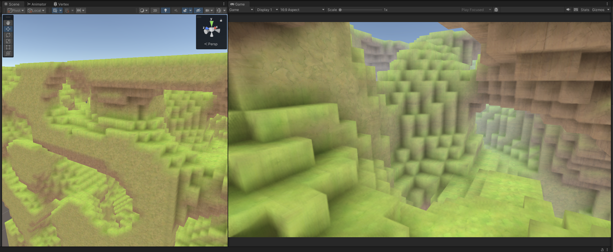

# Unity-SurfaceNet-VoxelTerrain
Implementation of Voxel procedural generation and Naive Surface-Net smoothing algorithm

- [x] Voxel Generation
- [x] Voxel Optimizations ( Inner faces )
- [x] Perlin Nose prodecural world
- [x] Chunks
- [x] Naive Surface-Net Smoothing
- [ ] Ground level and byomes
- [ ] Chunk culling
- [ ] Grass and vegetation
- [ ] Advanced material/shader

### Example with Surface-Net smoothing

### Example without smoothing
